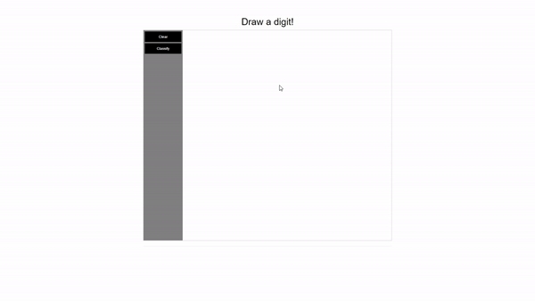

# Digit Recognition Web App

<p align="center">
  
</p>

This is a Django web application that allows users to draw a digit and get it classified using a pre-trained machine learning model. The application provides an interactive drawing board where users can sketch a digit, and upon submission, the application predicts the digit drawn.

## Programming Languages

   

# Features
- Interactive drawing board to sketch digits
- Digit classification using a pre-trained machine learning model
- Real-time prediction display
- Clearing functionality to start a new drawing

# Installation
Clone the repository:
```
git clone https://github.com/your-username/digit-recognition-web-app.git
```

Install the required dependencies: 
```
pip install -r requirements.txt
```
Download the pre-trained machine learning model [(lenet.h5)](https://github.com/Rye-Catcher/LeNet-5__Keras_MNIST/blob/master/lenet.h5) and place it in the root directory of the project.

Start the Django development server:
```
python manage.py runserver
```
Open your web browser and navigate to http://localhost:8000 to access the application.

# Usage
- Draw a digit on the drawing board using your mouse or touch input.
- Click the "Classify" button to submit the drawing for classification.
- The predicted digit will be displayed in real-time below the drawing board.
- To start a new drawing, click the "Clear" button.

# Customization
If you want to use a different pre-trained model, replace the lenet.h5 file in the root directory with your own model file. Make sure the model follows the same input and output conventions as the existing model.

You can modify the HTML structure, CSS styling, or JavaScript code in the index.html template to customize the appearance or behavior of the web application.

# Contributing
Contributions are welcome! If you have any suggestions, improvements, or bug fixes, please open an issue or submit a pull request.

# License
This project is licensed under the MIT License.
